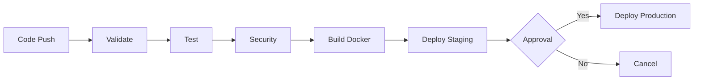

# Part 17: Pipeline as Code

## บทนำ

Pipeline as Code คือแนวคิดที่นำ pipeline configuration มาเก็บไว้ใน version control system เหมือนกับโค้ดทั่วไป แทนที่จะกำหนดค่าผ่าน GUI แนวคิดนี้เป็นส่วนหนึ่งของ "Everything as Code" philosophy ที่ช่วยให้ทีมสามารถจัดการ infrastructure และ processes ด้วยวิธีการเดียวกับการพัฒนา software

---

## 17.1 แนวคิด Pipeline as Code

### ปัญหาของ GUI-based Pipelines

ก่อนที่ Pipeline as Code จะแพร่หลาย ทีมส่วนใหญ่กำหนดค่า CI/CD ผ่าน web interface:

**ปัญหาที่พบบ่อย:**
1. **ไม่มี History** - ไม่รู้ว่าใครเปลี่ยนอะไรเมื่อไหร่
2. **ยากต่อการ Review** - ไม่สามารถ review changes ก่อน apply
3. **Difficult to Replicate** - ยากในการสร้าง pipeline เดิมในที่ใหม่
4. **No Collaboration** - ทีมไม่สามารถทำงานร่วมกันได้ดี
5. **Configuration Drift** - สภาพแวดล้อมต่างๆ เริ่มแตกต่างกันโดยไม่ตั้งใจ
6. **Single Point of Failure** - ถ้า CI server เสีย ต้องสร้าง pipeline ใหม่ทั้งหมด

### Pipeline as Code แก้ปัญหาอย่างไร

```
Pipeline as Code
├── Version Controlled
│   ├── ทุก change มี git history
│   ├── สามารถ rollback ได้
│   └── รู้ว่าใครเปลี่ยนอะไรเมื่อไหร่
├── Peer Reviewed
│   ├── Changes ผ่าน Pull Request process
│   ├── Team members review ก่อน merge
│   └── Automated testing ของ pipeline code
├── Reusable
│   ├── Template สำหรับ projects ประเภทเดียวกัน
│   ├── Shared libraries และ components
│   └── Copy-paste ที่ถูกต้อง
└── Reproducible
    ├── Disaster recovery ง่ายกว่า
    ├── สร้าง identical environments ได้
    └── Onboarding projects ใหม่เร็วขึ้น
```

### หลักการสำคัญ

```yaml
# แนวคิดหลักของ Pipeline as Code:

# 1. Treat pipeline config like application code
# - เขียน tests
# - Review ผ่าน PR
# - Version ให้ชัดเจน
# - Document อย่างละเอียด

# 2. Single Source of Truth
# - Pipeline definition อยู่ใน repository เดียวกับ code
# - ไม่มี "hidden" configuration ใน CI server

# 3. Self-documenting
# - Pipeline code ควรอ่านได้ง่าย
# - Comments บอก "ทำไม" ไม่ใช่ "ทำอะไร"

# 4. Immutable Infrastructure
# - Pipeline ไม่ mutate state
# - แต่ละ run เริ่มต้นใหม่

# 5. Fail Fast
# - ตรวจสอบ errors เร็วที่สุดใน pipeline
```

---

## 17.2 ข้อดีของ Version-controlled Pipelines

### การเปรียบเทียบ

| คุณสมบัติ | GUI Pipeline | Pipeline as Code |
|---------|------------|-----------------|
| Version control | ❌ | ✅ Git history |
| Code review | ❌ | ✅ Pull requests |
| Reproducibility | ❌ ยาก | ✅ ง่าย |
| Collaboration | ❌ จำกัด | ✅ เต็มรูปแบบ |
| Testing | ❌ ไม่ได้ | ✅ ได้ |
| Documentation | ❌ ต้องทำแยก | ✅ อยู่ใน code |
| Disaster recovery | ❌ ช้า/ยาก | ✅ เร็ว/ง่าย |
| Onboarding | ❌ ต้องอธิบาย | ✅ อ่าน code |

### ตัวอย่างจริง: Audit Trail

```bash
# ด้วย Pipeline as Code เราสามารถดู history ได้
git log --oneline .github/workflows/deploy.yml

# Output:
# a1b2c3d fix: add rollback step in production deploy
# e4f5g6h feat: add OIDC authentication for AWS
# i7j8k9l chore: increase timeout from 5m to 10m
# l0m1n2o fix: wrong environment variable name
# p3q4r5s feat: add staging environment

# ดูว่า change ทำอะไร
git show a1b2c3d

# ดูว่าใครเปลี่ยน
git blame .github/workflows/deploy.yml

# Rollback ง่ายมาก
git revert a1b2c3d
```

---

## 17.3 DRY Principles ใน Pipelines

### Don't Repeat Yourself

DRY (Don't Repeat Yourself) เป็นหลักการ software engineering ที่ใช้ได้กับ pipeline code เช่นกัน

### ตัวอย่างปัญหา: Duplicated Configuration

```yaml
# ❌ BAD: Duplicated configuration ทุก service

# service-a/.github/workflows/deploy.yml
name: Deploy Service A
on:
  push:
    branches: [main]
jobs:
  deploy:
    runs-on: ubuntu-latest
    steps:
      - uses: actions/checkout@v4
      - name: Setup Node
        uses: actions/setup-node@v4
        with:
          node-version: '20'
      - run: npm ci
      - run: npm run build
      - name: Docker Build
        run: |
          docker build -t registry.io/service-a:${{ github.sha }} .
          docker push registry.io/service-a:${{ github.sha }}
      - name: Deploy to K8s
        run: |
          kubectl set image deployment/service-a service-a=registry.io/service-a:${{ github.sha }}

# service-b/.github/workflows/deploy.yml
name: Deploy Service B
# ... exact same 90% of content ...

# service-c/.github/workflows/deploy.yml  
# ... exact same again ...
```

### แก้ด้วย DRY Approach

```yaml
# ✅ GOOD: Reusable workflow

# shared-workflows/.github/workflows/nodejs-service-deploy.yml
name: Node.js Service Deploy
on:
  workflow_call:
    inputs:
      service-name:
        required: true
        type: string
      node-version:
        required: false
        type: string
        default: '20'
      k8s-namespace:
        required: false
        type: string
        default: 'production'
    secrets:
      REGISTRY_TOKEN:
        required: true
      KUBECONFIG:
        required: true

jobs:
  deploy:
    runs-on: ubuntu-latest
    steps:
      - uses: actions/checkout@v4
      - uses: actions/setup-node@v4
        with:
          node-version: ${{ inputs.node-version }}
          cache: 'npm'
      - run: npm ci
      - run: npm run build
      - name: Docker Build and Push
        env:
          REGISTRY_TOKEN: ${{ secrets.REGISTRY_TOKEN }}
        run: |
          echo "$REGISTRY_TOKEN" | docker login registry.io --username ci --password-stdin
          docker build -t registry.io/${{ inputs.service-name }}:${{ github.sha }} .
          docker push registry.io/${{ inputs.service-name }}:${{ github.sha }}
      - name: Deploy to Kubernetes
        env:
          KUBECONFIG_DATA: ${{ secrets.KUBECONFIG }}
        run: |
          echo "$KUBECONFIG_DATA" > /tmp/kubeconfig
          kubectl --kubeconfig=/tmp/kubeconfig \
            set image deployment/${{ inputs.service-name }} \
            ${{ inputs.service-name }}=registry.io/${{ inputs.service-name }}:${{ github.sha }} \
            -n ${{ inputs.k8s-namespace }}

# service-a/.github/workflows/deploy.yml - เหลือแค่ 10 บรรทัด!
name: Deploy Service A
on:
  push:
    branches: [main]
jobs:
  deploy:
    uses: myorg/shared-workflows/.github/workflows/nodejs-service-deploy.yml@main
    with:
      service-name: service-a
    secrets:
      REGISTRY_TOKEN: ${{ secrets.REGISTRY_TOKEN }}
      KUBECONFIG: ${{ secrets.PROD_KUBECONFIG }}
```

---

## 17.4 Template Reuse

### Template Patterns

```yaml
# Pattern 1: Parameterized Templates (GitHub Actions)

# .github/workflows/templates/test-template.yml
name: Test Template
on:
  workflow_call:
    inputs:
      language:
        type: string
        required: true
      test-command:
        type: string
        default: 'test'
      coverage-threshold:
        type: number
        default: 80

jobs:
  test:
    runs-on: ubuntu-latest
    steps:
      - uses: actions/checkout@v4
      
      - name: Setup ${{ inputs.language }}
        uses: ./setup-${{ inputs.language }}  # Dynamic action selection
      
      - name: Install dependencies
        run: |
          case "${{ inputs.language }}" in
            nodejs)  npm ci ;;
            python)  pip install -r requirements.txt ;;
            go)      go mod download ;;
          esac
      
      - name: Run tests
        run: |
          case "${{ inputs.language }}" in
            nodejs)  npm run ${{ inputs.test-command }} ;;
            python)  python -m pytest ;;
            go)      go test ./... ;;
          esac
      
      - name: Check coverage threshold
        run: |
          COVERAGE=$(cat coverage.txt | grep -oP '\d+(?=%)' | head -1)
          if [ $COVERAGE -lt ${{ inputs.coverage-threshold }} ]; then
            echo "Coverage $COVERAGE% is below threshold ${{ inputs.coverage-threshold }}%"
            exit 1
          fi
```

### GitLab CI Template Library

```yaml
# templates/base-job.yml - Base template
.base-job-template:
  interruptible: true
  retry:
    max: 2
    when:
      - runner_system_failure
      - stuck_or_timeout_failure
  before_script:
    - echo "=== Job: $CI_JOB_NAME started at $(date) ==="
  after_script:
    - echo "=== Job: $CI_JOB_NAME finished at $(date) ==="

# templates/nodejs-build.yml
include:
  - local: 'templates/base-job.yml'

.nodejs-build-template:
  extends: .base-job-template
  image: node:${NODE_VERSION:-20}-alpine
  variables:
    NODE_ENV: ci
  cache:
    key:
      files:
        - package-lock.json
      prefix: npm-${NODE_VERSION:-20}
    paths:
      - node_modules/
      - .npm/
  before_script:
    - !reference [.base-job-template, before_script]  # ใช้ before_script จาก parent
    - npm ci --cache .npm --prefer-offline

# templates/docker-build.yml
.docker-build-template:
  extends: .base-job-template
  image: docker:24
  services:
    - docker:24-dind
  variables:
    DOCKER_TLS_CERTDIR: "/certs"
    DOCKER_BUILDKIT: "1"
  before_script:
    - !reference [.base-job-template, before_script]
    - docker login -u $CI_REGISTRY_USER -p $CI_REGISTRY_PASSWORD $CI_REGISTRY
  
  script:
    - docker build
        --cache-from $CI_REGISTRY_IMAGE:cache
        --build-arg BUILDKIT_INLINE_CACHE=1
        -t $CI_REGISTRY_IMAGE:$CI_COMMIT_SHORT_SHA
        -t $CI_REGISTRY_IMAGE:$CI_COMMIT_REF_SLUG
        .
    - docker push $CI_REGISTRY_IMAGE:$CI_COMMIT_SHORT_SHA
    - docker push $CI_REGISTRY_IMAGE:$CI_COMMIT_REF_SLUG
    - docker tag $CI_REGISTRY_IMAGE:$CI_COMMIT_SHORT_SHA $CI_REGISTRY_IMAGE:cache
    - docker push $CI_REGISTRY_IMAGE:cache
```

### Jenkinsfile Template Library

```groovy
// shared-library/vars/standardPipeline.groovy
/**
 * Standard Pipeline Template
 * 
 * Usage:
 *   standardPipeline(
 *     language: 'nodejs',
 *     appName: 'myapp',
 *     deployEnvironments: ['staging', 'production']
 *   )
 */
def call(Map config) {
    // ค่า defaults
    config.language = config.language ?: 'nodejs'
    config.deployEnvironments = config.deployEnvironments ?: ['staging']
    config.testCommand = config.testCommand ?: 'test'
    config.buildCommand = config.buildCommand ?: 'build'
    
    pipeline {
        agent any
        
        options {
            timeout(time: 1, unit: 'HOURS')
            buildDiscarder(logRotator(numToKeepStr: '20'))
            timestamps()
        }
        
        stages {
            stage('Checkout') {
                steps {
                    checkout scm
                }
            }
            
            stage('Setup') {
                steps {
                    script {
                        setupLanguage(config.language)
                    }
                }
            }
            
            stage('Install') {
                steps {
                    script {
                        installDependencies(config.language)
                    }
                }
            }
            
            stage('Test') {
                steps {
                    script {
                        runTests(config.language, config.testCommand)
                    }
                }
            }
            
            stage('Build') {
                steps {
                    script {
                        buildApp(config.language, config.buildCommand)
                    }
                }
            }
            
            stage('Docker') {
                steps {
                    script {
                        def imageTag = buildDocker(config.appName)
                        env.DOCKER_IMAGE = imageTag
                    }
                }
            }
            
            // Dynamic deployment stages
            script {
                config.deployEnvironments.each { env ->
                    stage("Deploy ${env.capitalize()}") {
                        steps {
                            script {
                                if (env == 'production') {
                                    input message: "Deploy to production?", ok: 'Deploy'
                                }
                                deployApp(config.appName, env, env.DOCKER_IMAGE)
                            }
                        }
                    }
                }
            }
        }
        
        post {
            always {
                cleanWs()
                notifyTeam(currentBuild.result)
            }
        }
    }
}

// Helper functions
def setupLanguage(String language) {
    switch(language) {
        case 'nodejs':
            tool 'NodeJS-20'
            break
        case 'python':
            sh 'python3 --version'
            break
        case 'java':
            tool 'JDK17'
            break
        default:
            error "Unsupported language: ${language}"
    }
}

def installDependencies(String language) {
    switch(language) {
        case 'nodejs':
            sh 'npm ci'
            break
        case 'python':
            sh 'pip install -r requirements.txt'
            break
        case 'java':
            sh './mvnw dependency:resolve'
            break
    }
}

// Jenkinsfile ใช้งาน template
// @Library('shared-library@main') _
// standardPipeline(
//     language: 'nodejs',
//     appName: 'my-service',
//     deployEnvironments: ['staging', 'production']
// )
```

---

## 17.5 Composable Pipelines

### การออกแบบ Pipeline Components

```yaml
# pipeline-components/steps/security-scan.yml
# Component: Security Scanning

.security-scan-component:
  stage: security
  variables:
    SCAN_SEVERITY: HIGH
  script:
    - echo "Running security scan..."
    
    # SAST
    - |
      if command -v semgrep &>/dev/null; then
        semgrep --config=auto --severity=$SCAN_SEVERITY . \
          --output=semgrep-results.json --format=json
      fi
    
    # Dependency scan
    - |
      if [ -f package.json ]; then
        npm audit --json > npm-audit.json || true
        node -e "
          const audit = require('./npm-audit.json');
          const high = audit.metadata?.vulnerabilities?.high || 0;
          const critical = audit.metadata?.vulnerabilities?.critical || 0;
          if (high + critical > 0) {
            console.log('HIGH/CRITICAL vulnerabilities found!');
            process.exit(1);
          }
        "
      fi
    
    # Secret detection
    - gitleaks detect --source=. --report-path=gitleaks-report.json || true
  
  artifacts:
    when: always
    paths:
      - '*-results.json'
      - '*-report.json'
    reports:
      sast: semgrep-results.json
```

### Composing Pipelines จาก Components

```yaml
# .gitlab-ci.yml - Composed from components

include:
  - local: 'pipeline-components/steps/security-scan.yml'
  - local: 'pipeline-components/steps/docker-build.yml'
  - local: 'pipeline-components/steps/k8s-deploy.yml'
  - local: 'pipeline-components/steps/notifications.yml'

stages:
  - test
  - security
  - build
  - deploy

# Compose jobs จาก components
security-check:
  extends:
    - .security-scan-component
    - .notify-on-failure-component
  rules:
    - if: $CI_PIPELINE_SOURCE == "merge_request_event"
    - if: $CI_COMMIT_BRANCH == "main"

build-docker:
  extends:
    - .docker-build-component
  variables:
    DOCKER_EXTRA_ARGS: "--build-arg NODE_ENV=production"

deploy-staging:
  extends:
    - .k8s-deploy-component
    - .notify-deployment-component
  variables:
    K8S_NAMESPACE: staging
    DEPLOYMENT_ENV: staging
  rules:
    - if: $CI_COMMIT_BRANCH == "main"
```

### Pipeline Composition ใน GitHub Actions

```yaml
# .github/workflows/main.yml
# Composed workflow

name: Main Pipeline

on:
  push:
    branches: [main, develop]
  pull_request:

# Reuse เป็นหน่วยย่อยๆ
jobs:
  # Component: Code Quality
  code-quality:
    uses: ./.github/workflows/components/code-quality.yml
    with:
      node-version: '20'
  
  # Component: Security
  security:
    uses: ./.github/workflows/components/security-scan.yml
    secrets:
      SNYK_TOKEN: ${{ secrets.SNYK_TOKEN }}
  
  # Component: Build
  build:
    needs: [code-quality]
    uses: ./.github/workflows/components/docker-build.yml
    with:
      image-name: myapp
    secrets:
      REGISTRY_TOKEN: ${{ secrets.GITHUB_TOKEN }}
  
  # Component: Deploy Staging
  deploy-staging:
    needs: [build, security]
    if: github.ref == 'refs/heads/main' || github.ref == 'refs/heads/develop'
    uses: ./.github/workflows/components/deploy-k8s.yml
    with:
      environment: staging
      image-tag: ${{ needs.build.outputs.image-tag }}
    secrets:
      KUBECONFIG: ${{ secrets.STAGING_KUBECONFIG }}
  
  # Component: Integration Tests
  integration-tests:
    needs: [deploy-staging]
    uses: ./.github/workflows/components/integration-tests.yml
    with:
      target-url: ${{ needs.deploy-staging.outputs.app-url }}
  
  # Component: Deploy Production (manual)
  deploy-production:
    needs: [integration-tests]
    if: github.ref == 'refs/heads/main'
    uses: ./.github/workflows/components/deploy-k8s.yml
    with:
      environment: production
      image-tag: ${{ needs.build.outputs.image-tag }}
    secrets:
      KUBECONFIG: ${{ secrets.PROD_KUBECONFIG }}
```

---

## 17.6 Configuration as Code

### ความแตกต่างระหว่าง Configuration และ Pipeline

```yaml
# Configuration as Code - กำหนดค่าระบบ
# Pipeline as Code - กำหนดขั้นตอนการทำงาน

# ตัวอย่าง: Infrastructure Configuration
# terraform/environments/staging/main.tf
# (นี่คือ Configuration as Code - กำหนด infrastructure)

# ตัวอย่าง: Pipeline ที่ deploy infrastructure
# .github/workflows/terraform.yml
# (นี่คือ Pipeline as Code - กำหนดขั้นตอน deploy)
```

### Application Configuration as Code

```yaml
# config/environments/staging.yaml
# (Configuration ที่ pipeline ใช้)

app:
  replicas: 2
  resources:
    requests:
      cpu: "250m"
      memory: "256Mi"
    limits:
      cpu: "500m"
      memory: "512Mi"
  
  environment:
    LOG_LEVEL: "info"
    FEATURE_FLAGS: "new-dashboard=true,beta-api=false"
    
  monitoring:
    enabled: true
    scrape_interval: "30s"

database:
  pool_size: 5
  max_connections: 20

---
# config/environments/production.yaml
app:
  replicas: 5
  resources:
    requests:
      cpu: "500m"
      memory: "512Mi"
    limits:
      cpu: "2"
      memory: "2Gi"
  
  environment:
    LOG_LEVEL: "warn"
    FEATURE_FLAGS: "new-dashboard=true,beta-api=false"
    
  monitoring:
    enabled: true
    scrape_interval: "15s"

database:
  pool_size: 20
  max_connections: 100
```

### Pipeline ที่ใช้ Configuration Files

```yaml
# .github/workflows/deploy.yml

name: Deploy with Config

on:
  workflow_call:
    inputs:
      environment:
        required: true
        type: string

jobs:
  deploy:
    runs-on: ubuntu-latest
    
    steps:
      - uses: actions/checkout@v4
      
      - name: Load environment config
        id: config
        run: |
          CONFIG_FILE="config/environments/${{ inputs.environment }}.yaml"
          
          if [ ! -f "$CONFIG_FILE" ]; then
            echo "Config file not found: $CONFIG_FILE"
            exit 1
          fi
          
          # Parse YAML config
          REPLICAS=$(yq e '.app.replicas' $CONFIG_FILE)
          CPU_REQUEST=$(yq e '.app.resources.requests.cpu' $CONFIG_FILE)
          MEMORY_REQUEST=$(yq e '.app.resources.requests.memory' $CONFIG_FILE)
          
          echo "replicas=$REPLICAS" >> $GITHUB_OUTPUT
          echo "cpu_request=$CPU_REQUEST" >> $GITHUB_OUTPUT
          echo "memory_request=$MEMORY_REQUEST" >> $GITHUB_OUTPUT
      
      - name: Deploy with loaded config
        run: |
          helm upgrade --install myapp ./helm/myapp \
            --namespace ${{ inputs.environment }} \
            --set replicaCount=${{ steps.config.outputs.replicas }} \
            --set resources.requests.cpu=${{ steps.config.outputs.cpu_request }} \
            --set resources.requests.memory=${{ steps.config.outputs.memory_request }} \
            --values config/environments/${{ inputs.environment }}.yaml
```

---

## 17.7 Policy as Code พื้นฐาน

### การบังคับใช้ Security Policies

```yaml
# policy/pipeline-policies.rego
# Open Policy Agent (OPA) policies

package pipeline

# Policy 1: Production deploy ต้องมาจาก main branch เท่านั้น
deny_production_deploy_from_non_main[msg] {
    input.environment == "production"
    input.branch != "main"
    msg := sprintf("Production deployment only allowed from main branch, got: %v", [input.branch])
}

# Policy 2: Docker images ต้องผ่าน security scan
deny_unscanned_image[msg] {
    not input.security_scan_passed
    msg := "Docker image must pass security scan before deployment"
}

# Policy 3: ต้องมี test coverage อย่างน้อย 80%
deny_low_coverage[msg] {
    input.test_coverage < 80
    msg := sprintf("Test coverage %v%% is below minimum 80%%", [input.test_coverage])
}

# Policy 4: ห้าม deploy เวลา business hours ยกเว้น emergency
deny_business_hours_deploy[msg] {
    input.environment == "production"
    not input.emergency
    is_business_hours
    msg := "Production deploys during business hours require emergency flag"
}

is_business_hours {
    hour := time.clock(time.now_ns())[0]
    hour >= 9
    hour <= 17
}
```

```yaml
# .github/workflows/policy-check.yml

name: Policy Check

on:
  workflow_call:
    inputs:
      environment:
        type: string
        required: true
      branch:
        type: string
        required: true

jobs:
  policy-check:
    runs-on: ubuntu-latest
    
    steps:
      - uses: actions/checkout@v4
      
      - name: Install OPA
        run: |
          curl -L -o /usr/local/bin/opa https://openpolicyagent.org/downloads/latest/opa_linux_amd64
          chmod +x /usr/local/bin/opa
      
      - name: Gather pipeline context
        id: context
        run: |
          # รวม context จากหลาย sources
          cat > /tmp/pipeline-context.json << EOF
          {
            "environment": "${{ inputs.environment }}",
            "branch": "${{ inputs.branch }}",
            "security_scan_passed": true,
            "test_coverage": 85,
            "emergency": false
          }
          EOF
      
      - name: Check policies
        run: |
          opa eval \
            --data policy/pipeline-policies.rego \
            --input /tmp/pipeline-context.json \
            "data.pipeline.deny_production_deploy_from_non_main" \
            --format pretty
          
          # ถ้ามี violations ให้ fail
          VIOLATIONS=$(opa eval \
            --data policy/pipeline-policies.rego \
            --input /tmp/pipeline-context.json \
            "data.pipeline" \
            --format json | jq '[.. | strings | select(startswith("deny_"))] | length')
          
          if [ "$VIOLATIONS" -gt "0" ]; then
            echo "Policy violations found!"
            exit 1
          fi
          
          echo "All policies passed!"
```

### Conftest สำหรับ Kubernetes Policies

```yaml
# policy/kubernetes/deployment-policy.rego

package main

# ห้าม run as root
deny[msg] {
    input.kind == "Deployment"
    container := input.spec.template.spec.containers[_]
    not container.securityContext.runAsNonRoot
    msg := sprintf("Container %v must run as non-root", [container.name])
}

# ต้องมี resource limits
deny[msg] {
    input.kind == "Deployment"
    container := input.spec.template.spec.containers[_]
    not container.resources.limits
    msg := sprintf("Container %v must have resource limits", [container.name])
}

# ต้องมี health checks
deny[msg] {
    input.kind == "Deployment"
    container := input.spec.template.spec.containers[_]
    not container.livenessProbe
    msg := sprintf("Container %v must have liveness probe", [container.name])
}

deny[msg] {
    input.kind == "Deployment"
    container := input.spec.template.spec.containers[_]
    not container.readinessProbe
    msg := sprintf("Container %v must have readiness probe", [container.name])
}
```

```yaml
# Pipeline ที่ใช้ Conftest

      - name: Check Kubernetes policies
        run: |
          # ติดตั้ง conftest
          curl -L https://github.com/open-policy-agent/conftest/releases/download/v0.46.0/conftest_0.46.0_Linux_x86_64.tar.gz | tar xz
          mv conftest /usr/local/bin/
          
          # สร้าง Kubernetes manifests จาก helm template
          helm template myapp ./helm/myapp --values values.yaml > /tmp/manifests.yaml
          
          # ตรวจสอบ policies
          conftest test /tmp/manifests.yaml \
            --policy policy/kubernetes/ \
            --output json > policy-results.json
          
          cat policy-results.json
          
          # Check for failures
          FAILURES=$(cat policy-results.json | jq '[.[] | select(.failures | length > 0)] | length')
          if [ "$FAILURES" -gt "0" ]; then
            echo "Kubernetes policy violations found!"
            cat policy-results.json | jq '.[] | .failures[] | .msg'
            exit 1
          fi
```

---

## 17.8 Pipeline Testing

### Unit Testing สำหรับ Pipeline Code

```groovy
// test/PipelineTest.groovy (Jenkins Pipeline Unit Testing)

import com.lesfurets.jenkins.unit.BasePipelineTest
import org.junit.Before
import org.junit.Test

class DeployPipelineTest extends BasePipelineTest {
    
    def script
    
    @Before
    void setUp() {
        super.setUp()
        // Setup mocks
        helper.registerAllowedMethod('sh', [Map]) { Map args ->
            return 0
        }
        helper.registerAllowedMethod('input', [Map]) { Map args ->
            return "approved"
        }
    }
    
    @Test
    void testStagingDeployment() {
        // Mock environment
        binding.setVariable('BRANCH_NAME', 'develop')
        binding.setVariable('BUILD_NUMBER', '42')
        
        script = loadScript('Jenkinsfile')
        script.execute()
        
        // ตรวจสอบว่า staging deployment ถูก call
        assertJobStatusSuccess()
        assertTrue(helper.callStack.findAll {
            it.methodName == 'sh' && 
            it.args[0].toString().contains('deploy.sh staging')
        }.size() > 0)
    }
    
    @Test
    void testProductionDeploymentRequiresApproval() {
        binding.setVariable('BRANCH_NAME', 'main')
        binding.setVariable('BUILD_NUMBER', '42')
        
        script = loadScript('Jenkinsfile')
        script.execute()
        
        // ตรวจสอบว่า input() ถูก call สำหรับ production
        assertTrue(helper.callStack.findAll {
            it.methodName == 'input'
        }.size() > 0)
    }
    
    @Test
    void testSkipsDeploymentOnFeatureBranch() {
        binding.setVariable('BRANCH_NAME', 'feature/my-feature')
        binding.setVariable('BUILD_NUMBER', '42')
        
        script = loadScript('Jenkinsfile')
        script.execute()
        
        // ตรวจสอบว่าไม่มี deploy commands
        assertFalse(helper.callStack.any {
            it.methodName == 'sh' && 
            it.args[0].toString().contains('deploy.sh')
        })
    }
}
```

### Testing GitHub Actions Workflows

```yaml
# .github/workflows/test-workflows.yml
# ทดสอบ workflow ด้วย act (local runner)

name: Test Workflows

on:
  push:
    paths:
      - '.github/workflows/**'

jobs:
  test-build-workflow:
    runs-on: ubuntu-latest
    steps:
      - uses: actions/checkout@v4
      
      - name: Install act
        run: |
          curl https://raw.githubusercontent.com/nektos/act/master/install.sh | sudo bash
      
      - name: Test build workflow
        run: |
          # รัน workflow locally
          act push \
            --workflows .github/workflows/build.yml \
            --eventpath test/fixtures/push-event.json \
            --env-file test/fixtures/test.env \
            --dry-run
      
      - name: Validate YAML syntax
        run: |
          # ติดตั้ง actionlint
          curl -s https://raw.githubusercontent.com/rhysd/actionlint/main/scripts/download-actionlint.bash | bash
          
          # ตรวจสอบ syntax
          ./actionlint .github/workflows/*.yml

  test-reusable-workflow:
    runs-on: ubuntu-latest
    steps:
      - uses: actions/checkout@v4
      
      - name: Test reusable workflow inputs
        run: |
          # ตรวจสอบว่า workflow มี required inputs ครบ
          python3 scripts/validate-workflow.py \
            .github/workflows/reusable-deploy.yml \
            --check-required-inputs \
            --check-output-names
```

### Automated Pipeline Validation

```python
#!/usr/bin/env python3
# scripts/validate-pipeline.py

import yaml
import sys
import os
from pathlib import Path

def validate_github_workflow(filepath):
    """ตรวจสอบ GitHub Actions workflow"""
    errors = []
    
    with open(filepath) as f:
        workflow = yaml.safe_load(f)
    
    # ตรวจสอบ required fields
    if 'name' not in workflow:
        errors.append("Missing 'name' field")
    
    if 'on' not in workflow:
        errors.append("Missing 'on' trigger")
    
    if 'jobs' not in workflow:
        errors.append("Missing 'jobs' field")
        return errors
    
    # ตรวจสอบแต่ละ job
    for job_name, job in workflow['jobs'].items():
        if 'runs-on' not in job and 'uses' not in job:
            errors.append(f"Job '{job_name}' missing 'runs-on' or 'uses'")
        
        if 'steps' in job:
            for i, step in enumerate(job['steps']):
                if 'uses' not in step and 'run' not in step:
                    errors.append(f"Step {i} in job '{job_name}' must have 'uses' or 'run'")
                
                # ตรวจสอบ secrets exposure
                if 'run' in step:
                    script = step['run']
                    if 'echo' in script and 'secrets' in script:
                        errors.append(f"Potential secret exposure in job '{job_name}' step {i}")
    
    # ตรวจสอบ timeout
    for job_name, job in workflow['jobs'].items():
        if 'timeout-minutes' not in job.get('options', {}) and 'uses' not in job:
            pass  # ไม่ required แต่ recommended
    
    return errors


def validate_all_workflows():
    """ตรวจสอบทุก workflow files"""
    workflow_dir = Path('.github/workflows')
    all_passed = True
    
    for filepath in workflow_dir.glob('*.yml'):
        print(f"Validating: {filepath}")
        errors = validate_github_workflow(filepath)
        
        if errors:
            all_passed = False
            print(f"❌ {filepath} has {len(errors)} error(s):")
            for error in errors:
                print(f"  - {error}")
        else:
            print(f"✅ {filepath} is valid")
    
    return all_passed


if __name__ == '__main__':
    if not validate_all_workflows():
        sys.exit(1)
    print("All workflows validated successfully!")
```

---

## 17.9 Pipeline Documentation

### Self-documenting Pipeline

```yaml
# .github/workflows/deploy.yml
# 
# OVERVIEW
# =========
# Pipeline นี้จัดการ deployment lifecycle สำหรับ myapp
# ตั้งแต่ code push จนถึง production deployment
#
# STAGES
# ======
# 1. validate   - Code quality checks (lint, type-check)
# 2. test       - Unit + Integration tests
# 3. security   - SAST, dependency scan, secrets detection
# 4. build      - Docker image build + push
# 5. staging    - Auto-deploy to staging
# 6. production - Manual-approved production deploy
#
# REQUIREMENTS
# ============
# Secrets ที่ต้องตั้งค่าใน GitHub Settings:
# - REGISTRY_TOKEN      : Token สำหรับ Container Registry
# - STAGING_KUBECONFIG  : kubeconfig สำหรับ staging cluster
# - PROD_KUBECONFIG     : kubeconfig สำหรับ production cluster
# - SLACK_WEBHOOK       : Slack incoming webhook URL
#
# Environments ที่ต้องสร้างใน GitHub:
# - staging    : Auto-deploy, no approval required
# - production : Manual approval required, reviewer: devops-team
#
# MAINTENANCE
# ===========
# Owner: DevOps Team (devops@company.com)
# Last Updated: 2024-01-15
# Version: 2.3.0

name: Deploy myapp

on:
  push:
    branches:
      - main      # Production deployments
      - develop   # Staging deployments only

# ใช้ concurrency เพื่อป้องกัน deployment ซ้อนกัน
# ref ต่างกันสามารถ deploy พร้อมกันได้
concurrency:
  group: deploy-${{ github.ref }}
  cancel-in-progress: false  # ไม่ cancel deploy ที่กำลังทำอยู่

jobs:
  # ────────────────────────────────────────────────────
  # STAGE 1: Validate
  # ตรวจสอบ code quality เพื่อ fail fast ก่อนทำ expensive tasks
  # ────────────────────────────────────────────────────
  validate:
    name: Code Quality
    runs-on: ubuntu-latest
    steps:
      - uses: actions/checkout@v4
      
      # ใช้ cache เพื่อเพิ่มความเร็ว
      - uses: actions/setup-node@v4
        with:
          node-version: '20'
          cache: 'npm'
      
      - run: npm ci
      
      # ESLint + TypeScript type checking
      - name: Lint and type check
        run: |
          npm run lint
          npm run type-check
```

### Pipeline README

```markdown
# Pipeline Documentation

## Overview



## Pipeline Stages

### 1. Validate (< 2 minutes)
- ESLint code style check
- TypeScript type checking
- **Fails fast** เพื่อให้ developers รู้เร็วที่สุด

### 2. Test (5-10 minutes)
- Unit tests
- Integration tests กับ PostgreSQL + Redis
- Coverage threshold: 80%

### 3. Security (3-5 minutes)
- SAST scanning ด้วย Semgrep
- Dependency vulnerabilities ด้วย npm audit
- Secret detection ด้วย Gitleaks

### 4. Build (3-5 minutes)
- Multi-platform Docker build (amd64, arm64)
- Push ไปยัง GitHub Container Registry
- Sign image ด้วย Cosign

### 5. Deploy Staging (auto)
- Deploy ไปยัง staging cluster
- รัน smoke tests
- Update deployment status

### 6. Deploy Production (manual)
- ต้องการ approval จาก DevOps team
- Zero-downtime deployment
- Auto-rollback ถ้า health check ล้มเหลว

## Required Configuration

| Name | Type | Description |
|------|------|-------------|
| `REGISTRY_TOKEN` | Secret | GitHub PAT สำหรับ push images |
| `STAGING_KUBECONFIG` | Secret | kubeconfig ของ staging |
| `PROD_KUBECONFIG` | Secret | kubeconfig ของ production |

## Troubleshooting

### Build ล้มเหลว
1. ดู logs ใน GitHub Actions tab
2. ตรวจสอบ Docker build errors
3. รัน `docker build .` locally

### Deploy ล้มเหลว
1. ตรวจสอบ pod status: `kubectl get pods -n production`
2. ดู pod logs: `kubectl logs deployment/myapp -n production`
3. Check rollout status: `kubectl rollout history deployment/myapp`
```

---

## 17.10 Migration Strategies

### จาก GUI ไปยัง Pipeline as Code

#### Phase 1: Document Current State

```bash
#!/bin/bash
# document-current-pipeline.sh
# ใช้ script นี้เพื่อ export configuration จาก Jenkins GUI

JENKINS_URL="http://jenkins.mycompany.com:8080"
JOB_NAME="my-old-job"
OUTPUT_DIR="./pipeline-migration"

mkdir -p $OUTPUT_DIR

# Export job configuration XML
curl -s "${JENKINS_URL}/job/${JOB_NAME}/config.xml" \
    -u "$JENKINS_USER:$JENKINS_TOKEN" \
    > "$OUTPUT_DIR/current-config.xml"

echo "Configuration exported to $OUTPUT_DIR/current-config.xml"
echo ""
echo "Review this file and convert to Jenkinsfile format"
```

#### Phase 2: Parallel Running

```groovy
// Phase 2: รัน pipeline ใหม่และเก่าพร้อมกัน เปรียบเทียบผลลัพธ์

pipeline {
    agent any
    
    parameters {
        booleanParam(name: 'USE_NEW_PIPELINE', defaultValue: false, 
                     description: 'ใช้ pipeline ใหม่ (A/B testing)')
    }
    
    stages {
        stage('Build (Legacy)') {
            when {
                expression { params.USE_NEW_PIPELINE == false }
            }
            steps {
                // Legacy build steps จาก GUI
                sh 'ant build'
                sh 'ant test'
            }
        }
        
        stage('Build (New)') {
            when {
                expression { params.USE_NEW_PIPELINE == true }
            }
            steps {
                // New pipeline as code
                sh 'gradle build'
                sh 'gradle test'
            }
        }
    }
}
```

#### Phase 3: Feature Flags สำหรับ Migration

```yaml
# .github/workflows/pipeline-with-migration.yml

name: Migrating Pipeline

on: [push]

env:
  # Feature flag สำหรับ migration
  # ตั้งค่าเป็น true เมื่อพร้อม migrate ทั้งหมด
  USE_NEW_BUILD_SYSTEM: ${{ vars.USE_NEW_BUILD_SYSTEM || 'false' }}

jobs:
  build:
    runs-on: ubuntu-latest
    steps:
      - uses: actions/checkout@v4
      
      # Legacy build (ใช้จนกว่าจะ migrate เสร็จ)
      - name: Build (Legacy)
        if: env.USE_NEW_BUILD_SYSTEM != 'true'
        run: |
          echo "Using legacy build system..."
          make build-legacy
      
      # New build system
      - name: Build (New)
        if: env.USE_NEW_BUILD_SYSTEM == 'true'
        run: |
          echo "Using new build system..."
          npm run build
      
      # Validation ระหว่าง migration
      - name: Compare outputs
        if: env.USE_NEW_BUILD_SYSTEM == 'true'
        run: |
          echo "Validating new build outputs match expected..."
          diff dist/expected dist/actual || echo "Differences found - investigation needed"
```

### Migration Checklist

```markdown
# Pipeline Migration Checklist

## ก่อน Migration
- [ ] Document ทุก step ของ pipeline ปัจจุบัน
- [ ] ระบุ dependencies และ integrations ทั้งหมด
- [ ] List secrets และ credentials ที่ใช้
- [ ] ตรวจสอบ environment-specific configurations
- [ ] เตรียม rollback plan

## ระหว่าง Migration
- [ ] สร้าง pipeline as code ใน feature branch
- [ ] Test กับ production-like data
- [ ] Compare results ระหว่าง old และ new pipeline
- [ ] Document ความแตกต่างที่พบ
- [ ] Review โดย team members

## หลัง Migration
- [ ] Monitor pipeline สักระยะ (1-2 สัปดาห์)
- [ ] ลบ old GUI configuration
- [ ] Update documentation
- [ ] Train team members
- [ ] Celebrate! 🎉
```

---

## 17.11 Advanced Patterns

### Pipeline Versioning

```yaml
# .github/workflows/versioned-deploy.yml
# Version: 3.0.0
# Changelog:
#   3.0.0 - Added OIDC authentication, removed static credentials
#   2.5.0 - Added canary deployment support
#   2.0.0 - Migrated to reusable workflows
#   1.0.0 - Initial implementation

name: Deploy v3

on:
  push:
    branches: [main]

jobs:
  deploy:
    uses: myorg/pipelines/.github/workflows/deploy-v3.yml@v3.0.0
    # ใช้ specific version ของ shared pipeline
    # เพื่อป้องกัน breaking changes
    with:
      app-name: myapp
    secrets: inherit
```

### Pipeline Observability

```yaml
# Pipeline ที่มี full observability

jobs:
  build:
    runs-on: ubuntu-latest
    
    steps:
      - uses: actions/checkout@v4
      
      - name: Start trace
        id: trace
        run: |
          TRACE_ID=$(uuidgen)
          echo "trace_id=$TRACE_ID" >> $GITHUB_OUTPUT
          echo "start_time=$(date +%s)" >> $GITHUB_OUTPUT
          
          # ส่ง trace เริ่มต้นไปยัง observability platform
          curl -s -X POST https://otel-collector.mycompany.com/traces \
            -H "Content-Type: application/json" \
            -d '{
              "trace_id": "'$TRACE_ID'",
              "operation": "pipeline_start",
              "service": "ci-pipeline",
              "tags": {
                "repo": "${{ github.repository }}",
                "branch": "${{ github.ref_name }}",
                "workflow": "${{ github.workflow }}"
              }
            }' || true
      
      - name: Build
        run: npm run build
      
      - name: Record metrics
        if: always()
        run: |
          DURATION=$(( $(date +%s) - ${{ steps.trace.outputs.start_time }} ))
          
          # ส่ง metrics
          curl -s -X POST https://metrics.mycompany.com/push \
            -H "Content-Type: application/json" \
            -d '{
              "metrics": [
                {
                  "name": "pipeline_duration_seconds",
                  "value": '$DURATION',
                  "labels": {
                    "repo": "${{ github.repository }}",
                    "workflow": "${{ github.workflow }}",
                    "status": "${{ job.status }}"
                  }
                }
              ]
            }' || true
```

---

## แบบฝึกหัด Part 17

### แบบฝึกหัดที่ 1: Pipeline Audit

วิเคราะห์ pipeline ที่มีอยู่และ identify:
1. Code duplication ทุกส่วน
2. Missing documentation
3. Security issues (hardcoded secrets, excessive permissions)
4. Missing tests
5. สร้าง improvement plan

### แบบฝึกหัดที่ 2: Template Library

สร้าง pipeline template library สำหรับองค์กร ที่รวม:
1. Template สำหรับ Node.js microservices
2. Template สำหรับ Python services
3. Template สำหรับ Go services
4. Shared security scanning component
5. Shared deployment component
6. Documentation สำหรับทุก template

### แบบฝึกหัดที่ 3: Policy Enforcement

Implement policy as code ที่:
1. บังคับ code coverage > 80%
2. ป้องกัน production deploy นอก business hours (ยกเว้น emergency)
3. บังคับว่า Docker images ต้องผ่าน security scan
4. ตรวจสอบ Kubernetes manifests ก่อน deploy
5. Generate policy violation report

### แบบฝึกหัดที่ 4: Pipeline Testing

สร้าง test suite สำหรับ pipeline code ที่:
1. Unit tests สำหรับ shared functions
2. Integration tests สำหรับ reusable workflows
3. End-to-end tests สำหรับ complete pipeline
4. Performance tests (วัด pipeline duration)
5. Security tests (ตรวจสอบ secret exposure)

### แบบฝึกหัดที่ 5: Migration Project

Migrate pipeline จาก GUI ไปยัง code:
1. Document current pipeline อย่างละเอียด
2. Identify gaps และ improvements
3. สร้าง pipeline as code
4. Test ด้วย parallel running
5. Gradual rollout ด้วย feature flags
6. Cleanup และ documentation

---

## สรุป

ในบทนี้เราได้เรียนรู้:

- **Pipeline as Code concept**: ทำไมต้องเก็บ pipeline ใน version control
- **ข้อดีของ version-controlled pipelines**: History, review, reproducibility
- **DRY principles**: ลด duplication ด้วย reusable components
- **Template reuse**: สร้าง template library สำหรับองค์กร
- **Composable pipelines**: Build complex pipelines จาก simple components
- **Configuration as Code**: แยก configuration ออกจาก pipeline logic
- **Policy as Code**: บังคับ governance rules อัตโนมัติ
- **Pipeline testing**: Unit, integration, และ E2E testing สำหรับ pipelines
- **Pipeline documentation**: Self-documenting และ structured docs
- **Migration strategies**: วิธีการย้ายจาก GUI ไปยัง code อย่างปลอดภัย

### Key Takeaways

1. **Pipeline code is production code** - ควรได้รับ quality standards เดียวกัน
2. **DRY สำคัญมาก** - ลด maintenance overhead อย่างมีนัยสำคัญ
3. **Test your pipelines** - Pipeline failures แพงมาก ทดสอบก่อน deploy
4. **Document everything** - Pipeline ที่ไม่มี docs เป็น technical debt
5. **Migrate gradually** - ใช้ feature flags และ parallel running

ในบทต่อไปเราจะเรียนรู้เรื่อง Containerization และ Docker ขั้นสูง ซึ่งจะช่วยให้เราสร้าง pipeline artifacts ที่ consistent และ portable ยิ่งขึ้น
