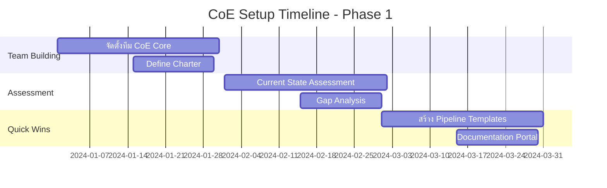

# Part 91: CI/CD Center of Excellence (CoE)

## บทนำ

CI/CD Center of Excellence (CoE) คือองค์กรหรือหน่วยงานภายในที่ทำหน้าที่เป็นศูนย์กลางความเชี่ยวชาญด้าน CI/CD ทำหน้าที่กำหนดมาตรฐาน แนวทางปฏิบัติที่ดีที่สุด และให้การสนับสนุนทีมต่างๆ ในองค์กร

ในบทนี้ เราจะเรียนรู้:
- การสร้างและจัดตั้ง CI/CD CoE
- บทบาทและความรับผิดชอบของสมาชิก CoE
- การสร้างวัฒนธรรมการแบ่งปันความรู้
- Community of Practice (CoP)
- Maturity Model สำหรับ CI/CD
- แบบฝึกหัดปฏิบัติ

---

## 91.1 ทำไมต้องมี CI/CD Center of Excellence?

### ปัญหาที่พบบ่อยในองค์กรขนาดใหญ่

เมื่อองค์กรเติบโตขึ้น ปัญหาด้าน CI/CD มักปรากฏขึ้นในรูปแบบต่างๆ:

```
ปัญหาทั่วไป:
├── แต่ละทีมสร้าง pipeline แบบ ad-hoc ไม่มีมาตรฐาน
├── ความรู้กระจัดกระจาย ไม่มีศูนย์กลาง
├── การ reinvent the wheel ซ้ำซ้อนในแต่ละทีม
├── มาตรฐานความปลอดภัยที่ไม่สม่ำเสมอ
├── ต้นทุนสูงจากการใช้ทรัพยากรซ้ำซ้อน
└── การ onboarding ทีมใหม่ใช้เวลานาน
```

### ประโยชน์ของ CoE

| ด้าน | ก่อนมี CoE | หลังมี CoE |
|------|-----------|-----------|
| เวลา setup pipeline | 2-3 สัปดาห์ | 1-2 วัน |
| มาตรฐานความปลอดภัย | แตกต่างทุกทีม | สม่ำเสมอ |
| การแก้ปัญหา | แต่ละทีมแก้เอง | มีผู้เชี่ยวชาญช่วย |
| ต้นทุนรวม | สูง (ซ้ำซ้อน) | ลดลง 30-50% |
| Innovation | ช้า | เร็วขึ้น |

---

## 91.2 โครงสร้างของ CI/CD CoE

### รูปแบบการจัดองค์กร CoE

มี 3 รูปแบบหลัก:

#### 1. Centralized CoE (ศูนย์กลางเต็มรูปแบบ)
```
                    ┌─────────────┐
                    │  CoE Lead   │
                    └──────┬──────┘
                           │
           ┌───────────────┼───────────────┐
           │               │               │
    ┌──────▼──────┐ ┌──────▼──────┐ ┌──────▼──────┐
    │  Platform   │ │  Security   │ │  Tooling    │
    │   Team      │ │   Team      │ │   Team      │
    └─────────────┘ └─────────────┘ └─────────────┘
```

**เหมาะสำหรับ:** องค์กรที่ต้องการควบคุมมาตรฐานสูง

**ข้อดี:**
- มาตรฐานสม่ำเสมอสูงสุด
- ง่ายต่อการ governance
- ทรัพยากรรวมศูนย์

**ข้อเสีย:**
- อาจเป็น bottleneck
- ทีม product อาจรู้สึกถูกจำกัด

#### 2. Federated CoE (กระจายอำนาจ)
```
         ┌─────────────────┐
         │   CoE Core      │
         │  (Standards &   │
         │   Guidelines)   │
         └────────┬────────┘
                  │ จัดหา templates & guidelines
         ┌────────┼────────┐
         │        │        │
    ┌────▼───┐ ┌──▼─────┐ ┌▼────────┐
    │Team A  │ │Team B  │ │Team C   │
    │Embed.  │ │Embed.  │ │Embed.   │
    │DevOps  │ │DevOps  │ │DevOps   │
    └────────┘ └────────┘ └─────────┘
```

**เหมาะสำหรับ:** องค์กรขนาดใหญ่ที่ต้องการความยืดหยุ่น

#### 3. Hybrid CoE (ผสมผสาน)
```
    ┌──────────────────────────────────┐
    │          CoE Core Team           │
    │  - Standards Definition          │
    │  - Shared Platform Services      │
    │  - Security & Compliance         │
    └────────────────┬─────────────────┘
                     │
     ┌───────────────┼───────────────┐
     │               │               │
┌────▼────┐    ┌──────▼──────┐  ┌────▼────┐
│Business │    │ Business    │  │Business │
│Unit A   │    │ Unit B      │  │Unit C   │
│(Own     │    │(Own         │  │(Own     │
│Champions)│   │Champions)   │  │Champions)│
└─────────┘    └─────────────┘  └─────────┘
```

---

## 91.3 บทบาทและความรับผิดชอบ

### ตำแหน่งหลักใน CoE

#### 1. CoE Lead / Head of DevOps Platform

**ความรับผิดชอบ:**
- กำหนดวิสัยทัศน์และกลยุทธ์ CI/CD ขององค์กร
- สื่อสารกับ C-Level executives
- จัดการงบประมาณและทรัพยากร
- วัดและรายงาน ROI ของ CI/CD initiatives

**ทักษะที่ต้องการ:**
```yaml
skills:
  technical:
    - DevOps practices (expert)
    - Cloud platforms (advanced)
    - Architecture design (advanced)
  soft:
    - Leadership
    - Stakeholder management
    - Strategic thinking
    - Communication
  experience: "7+ ปี DevOps/Platform Engineering"
```

#### 2. Platform Engineer

**ความรับผิดชอบ:**
- ออกแบบและพัฒนา shared CI/CD platform
- สร้าง reusable pipeline templates
- ดูแล infrastructure สำหรับ CI/CD tools
- Performance optimization

**ตัวอย่างงานจริง:**
```yaml
# งานประจำวันของ Platform Engineer
daily_tasks:
  morning:
    - ตรวจสอบ health ของ CI/CD infrastructure
    - Review incident reports จากคืนก่อน
    - Team standup
  afternoon:
    - พัฒนา/ปรับปรุง pipeline templates
    - Code review สำหรับ pipeline changes
    - ช่วยเหลือทีม product กับ pipeline issues
  recurring:
    weekly:
      - Performance metrics review
      - Platform roadmap update
    monthly:
      - Capacity planning
      - Cost optimization review
```

#### 3. DevOps Security Engineer (DevSecOps)

**ความรับผิดชอบ:**
- กำหนดมาตรฐานความปลอดภัยสำหรับ pipelines
- Implement security scanning ใน CI/CD
- Compliance monitoring
- Security incident response สำหรับ pipeline breaches

**Security Controls ที่ดูแล:**
```bash
# Security checklist ที่ DevSecOps ต้องดูแล

## Static Analysis
☐ SAST tools configured (SonarQube, Semgrep)
☐ Secret scanning enabled (GitLeaks, TruffleHog)
☐ Dependency vulnerability scanning (Snyk, OWASP)

## Dynamic Analysis
☐ DAST tools integrated (OWASP ZAP)
☐ Container scanning (Trivy, Clair)
☐ IaC scanning (Checkov, tfsec)

## Access Control
☐ Pipeline service accounts follow least privilege
☐ Secrets management via vault (not env vars)
☐ Audit logging enabled

## Compliance
☐ SOX controls implemented
☐ PCI-DSS requirements met
☐ GDPR data handling in pipelines
```

#### 4. CI/CD Evangelist / Champion

**ความรับผิดชอบ:**
- เผยแพร่ best practices ในองค์กร
- จัดอบรมและ workshops
- สร้างและดูแล documentation
- เป็น liaison ระหว่าง CoE และ product teams

#### 5. Tooling & Automation Engineer

**ความรับผิดชอบ:**
- ประเมินและเลือก tools ใหม่
- Integration ระหว่าง tools ต่างๆ
- Automation ของ operational tasks
- Tool licensing management

---

## 91.4 การสร้าง CoE ทีละขั้นตอน

### Phase 1: Foundation (เดือน 1-3)



**Deliverables Phase 1:**

1. **CoE Charter Document**
```markdown
# CI/CD Center of Excellence Charter

## Mission Statement
CoE ของเราทำหน้าที่เป็น enabler ให้ทีม engineering สามารถ
deliver software ได้เร็วขึ้น ปลอดภัยขึ้น และมีคุณภาพสูงขึ้น

## Scope
- กำหนดมาตรฐาน CI/CD สำหรับทุกทีม
- จัดหาและดูแล shared platform services
- ให้การฝึกอบรมและ consultation
- วัดและรายงาน engineering metrics

## Operating Model
- Federated: CoE กำหนด standards, teams implement
- Support model: CoE เป็น consulted, teams own pipelines

## Governance
- Monthly steering committee
- Quarterly metrics review
- Annual roadmap planning
```

2. **Current State Assessment Template**
```yaml
assessment:
  team: "Payment Service Team"
  date: "2024-01-15"
  
  ci_cd_maturity:
    version_control:
      score: 3/5
      notes: "ใช้ Git แต่ branching strategy ไม่ชัดเจน"
    
    build_automation:
      score: 2/5
      notes: "Manual builds บางส่วน"
    
    testing:
      score: 2/5
      notes: "Unit tests มีบ้าง แต่ integration tests น้อย"
    
    deployment:
      score: 1/5
      notes: "Manual deployment ผ่าน SSH"
    
    monitoring:
      score: 2/5
      notes: "มี basic monitoring แต่ไม่มี alerting"
  
  pain_points:
    - "Deployment ใช้เวลา 2 ชั่วโมง"
    - "บ่อยครั้งที่ production มี config ไม่ตรงกับ staging"
    - "ไม่มี rollback plan ชัดเจน"
  
  goals_6_months:
    - "Automated deployment ใน 15 นาที"
    - "Zero manual config differences"
    - "One-click rollback"
```

### Phase 2: Platform Build (เดือน 4-6)

**การสร้าง Shared Pipeline Templates:**

```yaml
# templates/standard-microservice-pipeline.yml
# GitLab CI template สำหรับ microservices

include:
  - template: Security/SAST.gitlab-ci.yml
  - template: Security/Secret-Detection.gitlab-ci.yml

variables:
  DOCKER_REGISTRY: "registry.company.internal"
  SONAR_HOST_URL: "https://sonar.company.internal"
  
stages:
  - validate
  - build
  - test
  - security-scan
  - package
  - deploy-dev
  - integration-test
  - deploy-staging
  - performance-test
  - deploy-prod

# ====== VALIDATE STAGE ======
lint:
  stage: validate
  image: node:18-alpine
  script:
    - npm ci --cache .npm
    - npm run lint
  cache:
    key: "$CI_PROJECT_NAME-npm"
    paths:
      - .npm/

validate-dockerfile:
  stage: validate
  image: hadolint/hadolint:latest-alpine
  script:
    - hadolint Dockerfile

# ====== BUILD STAGE ======
build:
  stage: build
  image: docker:24
  services:
    - docker:24-dind
  script:
    - docker build -t $DOCKER_REGISTRY/$CI_PROJECT_NAME:$CI_COMMIT_SHA .
    - docker push $DOCKER_REGISTRY/$CI_PROJECT_NAME:$CI_COMMIT_SHA
  only:
    - main
    - develop
    - /^release\/.*/

# ====== TEST STAGE ======
unit-test:
  stage: test
  image: node:18-alpine
  script:
    - npm ci
    - npm run test:unit -- --coverage
  coverage: '/Lines\s*:\s*(\d+\.\d+)%/'
  artifacts:
    reports:
      coverage_report:
        coverage_format: cobertura
        path: coverage/cobertura-coverage.xml
      junit: test-results/junit.xml

# ====== SECURITY SCAN ======
container-scan:
  stage: security-scan
  image:
    name: aquasec/trivy:latest
    entrypoint: [""]
  script:
    - trivy image 
        --exit-code 1 
        --severity HIGH,CRITICAL 
        --no-progress 
        $DOCKER_REGISTRY/$CI_PROJECT_NAME:$CI_COMMIT_SHA
  allow_failure: false

dependency-scan:
  stage: security-scan
  image: node:18-alpine
  script:
    - npm audit --audit-level=high
  allow_failure: false

# ====== DEPLOY TO DEV ======
deploy-dev:
  stage: deploy-dev
  image: bitnami/kubectl:latest
  environment:
    name: development
    url: https://dev.company.internal/$CI_PROJECT_NAME
  script:
    - kubectl set image deployment/$CI_PROJECT_NAME
        $CI_PROJECT_NAME=$DOCKER_REGISTRY/$CI_PROJECT_NAME:$CI_COMMIT_SHA
        -n development
    - kubectl rollout status deployment/$CI_PROJECT_NAME -n development
  only:
    - develop

# ====== DEPLOY TO STAGING ======
deploy-staging:
  stage: deploy-staging
  image: bitnami/kubectl:latest
  environment:
    name: staging
    url: https://staging.company.internal/$CI_PROJECT_NAME
  script:
    - kubectl set image deployment/$CI_PROJECT_NAME
        $CI_PROJECT_NAME=$DOCKER_REGISTRY/$CI_PROJECT_NAME:$CI_COMMIT_SHA
        -n staging
    - kubectl rollout status deployment/$CI_PROJECT_NAME -n staging
  only:
    - main

# ====== DEPLOY TO PROD ======
deploy-prod:
  stage: deploy-prod
  image: bitnami/kubectl:latest
  environment:
    name: production
    url: https://www.company.com
  when: manual
  script:
    - kubectl set image deployment/$CI_PROJECT_NAME
        $CI_PROJECT_NAME=$DOCKER_REGISTRY/$CI_PROJECT_NAME:$CI_COMMIT_SHA
        -n production
    - kubectl rollout status deployment/$CI_PROJECT_NAME -n production
  only:
    - main
```

### Phase 3: Adoption & Scaling (เดือน 7-12)

**Adoption Tracking Dashboard:**
```python
# adoption_tracker.py
# สคริปต์ติดตาม adoption rate ของ CoE standards

import gitlab
import json
from datetime import datetime, timedelta

class CoCAdoptionTracker:
    def __init__(self, gitlab_url, token):
        self.gl = gitlab.Gitlab(gitlab_url, private_token=token)
        
    def check_pipeline_standard_compliance(self, project_id):
        """ตรวจสอบว่า project ใช้ standard template หรือไม่"""
        project = self.gl.projects.get(project_id)
        
        try:
            ci_file = project.files.get('.gitlab-ci.yml', ref='main')
            content = ci_file.decode().decode('utf-8')
            
            compliance = {
                'uses_standard_template': 'standard-microservice-pipeline' in content,
                'has_security_scan': 'security-scan' in content,
                'has_unit_tests': 'unit-test' in content,
                'has_staging_env': 'deploy-staging' in content,
                'has_manual_prod_gate': "when: manual" in content
            }
            
            score = sum(compliance.values()) / len(compliance) * 100
            return {'project': project.name, 'score': score, 'details': compliance}
            
        except Exception as e:
            return {'project': project.name, 'score': 0, 'error': str(e)}
    
    def generate_adoption_report(self, group_id):
        """สร้างรายงาน adoption สำหรับทั้ง group"""
        group = self.gl.groups.get(group_id)
        projects = group.projects.list(all=True)
        
        results = []
        for project in projects:
            result = self.check_pipeline_standard_compliance(project.id)
            results.append(result)
        
        # สรุปผล
        avg_score = sum(r['score'] for r in results) / len(results)
        fully_compliant = [r for r in results if r['score'] == 100]
        
        report = {
            'generated_at': datetime.now().isoformat(),
            'total_projects': len(results),
            'average_compliance_score': round(avg_score, 1),
            'fully_compliant_count': len(fully_compliant),
            'fully_compliant_percentage': round(len(fully_compliant)/len(results)*100, 1),
            'projects': results
        }
        
        return report

# การใช้งาน
tracker = CoCAdoptionTracker('https://gitlab.company.com', 'your-token')
report = tracker.generate_adoption_report('engineering')
print(json.dumps(report, indent=2, ensure_ascii=False))
```

---

## 91.5 Knowledge Sharing และ Documentation

### สร้าง Internal Developer Portal

```
Developer Portal Structure:
├── Getting Started
│   ├── CI/CD Overview
│   ├── Quick Start Guide
│   └── FAQ
├── Standards & Guidelines
│   ├── Pipeline Standards
│   ├── Security Requirements
│   ├── Naming Conventions
│   └── Environment Standards
├── Templates & Examples
│   ├── Microservice Pipeline
│   ├── Frontend Pipeline
│   ├── ML Model Pipeline
│   └── Database Migration Pipeline
├── Tools & Platforms
│   ├── GitLab CI Reference
│   ├── ArgoCD Guide
│   ├── Kubernetes Deployment Guide
│   └── Monitoring Setup
├── Runbooks
│   ├── Incident Response
│   ├── Rollback Procedures
│   └── Common Issues
└── Learning Resources
    ├── Tutorials
    ├── Video Recordings
    └── External Resources
```

### Runbook Template

```markdown
# Runbook: Pipeline Failure Recovery

## Overview
ขั้นตอนการแก้ไขเมื่อ CI/CD pipeline ล้มเหลว

## Prerequisites
- Access to GitLab
- kubectl access to relevant cluster
- PagerDuty access (สำหรับ P1/P2)

## Severity Classification
| ระดับ | คำอธิบาย | เวลาตอบสนอง |
|-------|---------|------------|
| P1 | Production pipeline ล้มเหลว | 15 นาที |
| P2 | Staging pipeline ล้มเหลว | 1 ชั่วโมง |
| P3 | Development pipeline ล้มเหลว | 4 ชั่วโมง |

## Steps

### 1. ตรวจสอบสาเหตุ
```bash
# ดู pipeline logs
gitlab-ci logs --pipeline-id <ID>

# ตรวจสอบ pod status
kubectl get pods -n <namespace> --watch

# ดู events
kubectl get events -n <namespace> --sort-by='.lastTimestamp'
```

### 2. Common Issues & Solutions

#### Build Failure
```bash
# ตรวจสอบ Docker build logs
docker build --no-cache -t test-image .

# ตรวจสอบ disk space
df -h
```

#### Test Failure
```bash
# รัน tests locally
npm test -- --verbose

# ตรวจสอบ test database
kubectl exec -it test-db-pod -- psql -U testuser -c "\dt"
```

#### Deployment Failure
```bash
# ตรวจสอบ rollout status
kubectl rollout status deployment/<name> -n <namespace>

# Rollback ถ้าจำเป็น
kubectl rollout undo deployment/<name> -n <namespace>
```

## Escalation
ถ้าไม่สามารถแก้ปัญหาภายใน 30 นาที: แจ้ง CoE on-call engineer
Contact: #cicd-help Slack channel
```

---

## 91.6 Community of Practice (CoP)

### การสร้าง CI/CD Community of Practice

```
CoP Structure:
├── Leadership
│   ├── CoP Lead (CoE member)
│   └── Steering Committee (representatives จากแต่ละ BU)
├── Regular Activities
│   ├── Weekly: #cicd-chat Slack channel discussions
│   ├── Biweekly: Virtual office hours
│   ├── Monthly: CoP meeting (presentations + discussions)
│   └── Quarterly: Workshop / Hackathon
├── Knowledge Artifacts
│   ├── Slack channels: #cicd-best-practices, #cicd-tools, #cicd-help
│   ├── Confluence space: CI/CD CoP
│   ├── GitHub org: company-cicd-examples
│   └── Video library: Recorded sessions
└── Recognition
    ├── "Pipeline Hero" award ประจำเดือน
    ├── Internal blog posts
    └── Conference speaking opportunities
```

### Monthly CoP Meeting Agenda Template

```markdown
# CI/CD Community of Practice - Monthly Meeting

**วันที่:** [Date]
**เวลา:** 14:00 - 15:30 ICT
**Platform:** Zoom / Google Meet

## Agenda

### 1. Opening & Updates (10 นาที)
- ข่าวสารจาก CoE
- Metrics อัปเดต: pipeline performance ประจำเดือน

### 2. Case Study Presentation (30 นาที)
**หัวข้อ:** [ชื่อทีม] - [สิ่งที่พวกเขาทำ/แก้ปัญหา]
- Background
- ปัญหาที่พบ
- Solution ที่เลือก
- ผลลัพธ์
- Lessons Learned

### 3. Open Discussion (20 นาที)
- Q&A จาก case study
- Pain points จาก community
- Tips & tricks แบ่งปัน

### 4. Tool/Technology Spotlight (20 นาที)
**เดือนนี้:** [Tool/Technology ที่น่าสนใจ]

### 5. Action Items & Next Steps (10 นาที)
- สรุป action items
- Preview หัวข้อเดือนหน้า

## Resources
- Recording: [Link]
- Slides: [Link]
- Notes: [Link]
```

---

## 91.7 CI/CD Maturity Model

### 5 ระดับของ CI/CD Maturity

```
Level 1: Initial (Ad-hoc)
├── ไม่มี automated CI/CD
├── Manual builds และ deployments
├── Code stored in shared folders หรือ basic VCS
└── Heroes ไม่ใช่ processes

Level 2: Managed (Basic Automation)
├── Version control (Git)
├── Basic CI: automated builds
├── Manual testing เป็นส่วนใหญ่
└── บางส่วน automated tests

Level 3: Defined (Standardized)
├── CI pipeline มาตรฐาน
├── Automated unit + integration tests
├── Staging environment
└── Manual approval สำหรับ production

Level 4: Quantitatively Managed (Measured)
├── Full CI/CD pipeline
├── Automated deployment ทุก environment
├── Metrics-driven improvements
└── Blue/green deployments

Level 5: Optimizing (Continuous Improvement)
├── Fully automated end-to-end
├── Progressive delivery (canary, feature flags)
├── AI-assisted pipeline optimization
└── Continuous learning และ improvement
```

### Maturity Assessment Questionnaire

```python
# maturity_assessment.py
# เครื่องมือประเมิน CI/CD Maturity

class CICDMaturityAssessment:
    def __init__(self):
        self.questions = {
            "version_control": [
                {
                    "q": "ทีมใช้ Version Control System อะไร?",
                    "options": {
                        "a": ("ไม่มี VCS", 0),
                        "b": ("Shared folders / basic SVN", 1),
                        "c": ("Git แต่ไม่มี workflow ชัดเจน", 2),
                        "d": ("Git + branching strategy (GitFlow/trunk-based)", 3),
                        "e": ("Git + branching strategy + PR reviews", 4),
                    }
                },
                {
                    "q": "ทีมมี code review process อย่างไร?",
                    "options": {
                        "a": ("ไม่มี code review", 0),
                        "b": ("Informal peer review บางครั้ง", 1),
                        "c": ("PR review ก่อน merge เสมอ", 2),
                        "d": ("PR review + automated checks", 3),
                        "e": ("PR review + automated checks + required approvals", 4),
                    }
                }
            ],
            "build_automation": [
                {
                    "q": "Build process ของทีมเป็นอย่างไร?",
                    "options": {
                        "a": ("Manual build บน developer machine", 0),
                        "b": ("Build scripts แต่ manual trigger", 1),
                        "c": ("Automated build เมื่อ push code", 2),
                        "d": ("Automated build + artifact versioning", 3),
                        "e": ("Automated build + artifact versioning + build caching", 4),
                    }
                }
            ],
            "testing": [
                {
                    "q": "ทีมมี automated testing ระดับใด?",
                    "options": {
                        "a": ("ไม่มี automated tests", 0),
                        "b": ("Unit tests บ้าง (<20% coverage)", 1),
                        "c": ("Unit tests (>50% coverage)", 2),
                        "d": ("Unit + Integration tests", 3),
                        "e": ("Unit + Integration + E2E + Performance tests", 4),
                    }
                }
            ],
            "deployment": [
                {
                    "q": "Deployment process ปัจจุบันเป็นอย่างไร?",
                    "options": {
                        "a": ("Manual deployment ผ่าน SSH/FTP", 0),
                        "b": ("Deployment scripts แต่ manual trigger", 1),
                        "c": ("Automated deployment to non-prod", 2),
                        "d": ("Automated deployment ทุก environment (manual gate สำหรับ prod)", 3),
                        "e": ("Full automated + progressive delivery", 4),
                    }
                }
            ],
            "monitoring": [
                {
                    "q": "ทีมมี monitoring/observability ระดับใด?",
                    "options": {
                        "a": ("ไม่มี monitoring", 0),
                        "b": ("Basic server monitoring (CPU, memory)", 1),
                        "c": ("Application metrics + basic alerting", 2),
                        "d": ("Full observability (metrics, logs, traces)", 3),
                        "e": ("Full observability + automated anomaly detection", 4),
                    }
                }
            ]
        }
    
    def calculate_maturity(self, answers):
        """
        answers = {
            "version_control": [3, 4],
            "build_automation": [3],
            "testing": [2],
            "deployment": [3],
            "monitoring": [2]
        }
        """
        total_score = 0
        max_score = 0
        category_scores = {}
        
        for category, questions in self.questions.items():
            cat_answers = answers.get(category, [])
            cat_score = sum(cat_answers)
            cat_max = len(questions) * 4
            category_scores[category] = {
                'score': cat_score,
                'max': cat_max,
                'percentage': round(cat_score/cat_max*100, 1)
            }
            total_score += cat_score
            max_score += cat_max
        
        overall_percentage = total_score / max_score * 100
        
        if overall_percentage < 20:
            level = 1
            label = "Initial"
        elif overall_percentage < 40:
            level = 2
            label = "Managed"
        elif overall_percentage < 60:
            level = 3
            label = "Defined"
        elif overall_percentage < 80:
            level = 4
            label = "Quantitatively Managed"
        else:
            level = 5
            label = "Optimizing"
        
        return {
            'overall_score': round(overall_percentage, 1),
            'maturity_level': level,
            'maturity_label': label,
            'category_scores': category_scores,
            'recommendations': self.get_recommendations(level, category_scores)
        }
    
    def get_recommendations(self, level, category_scores):
        """สร้าง recommendations ตาม maturity level"""
        recommendations = []
        
        # หา weakest categories
        sorted_cats = sorted(category_scores.items(), key=lambda x: x[1]['percentage'])
        
        for cat, scores in sorted_cats[:2]:  # แก้ 2 จุดอ่อนก่อน
            if cat == 'testing' and scores['percentage'] < 50:
                recommendations.append({
                    'priority': 'HIGH',
                    'area': 'Testing',
                    'action': 'เพิ่ม automated test coverage ให้ถึง 70%',
                    'timeline': '3 เดือน'
                })
            elif cat == 'deployment' and scores['percentage'] < 50:
                recommendations.append({
                    'priority': 'HIGH',
                    'area': 'Deployment',
                    'action': 'Implement automated deployment ไปยัง staging',
                    'timeline': '2 เดือน'
                })
        
        return recommendations

# ตัวอย่างการใช้งาน
assessment = CICDMaturityAssessment()
answers = {
    "version_control": [3, 4],
    "build_automation": [3],
    "testing": [2],
    "deployment": [2],
    "monitoring": [2]
}

result = assessment.calculate_maturity(answers)
print(f"Maturity Level: {result['maturity_level']} - {result['maturity_label']}")
print(f"Overall Score: {result['overall_score']}%")
```

---

## 91.8 Metrics และ KPIs สำหรับ CoE

### DORA Metrics Dashboard

```python
# dora_metrics.py
# คำนวณ DORA Metrics สำหรับ CoE reporting

from datetime import datetime, timedelta
import statistics

class DORAMetricsCalculator:
    """คำนวณ 4 DORA Metrics หลัก"""
    
    def deployment_frequency(self, deployments: list, period_days: int = 30):
        """
        Deployment Frequency: บ่อยแค่ไหนที่ deploy to production
        
        Elite: On-demand (multiple times per day)
        High: Once per week to once per month
        Medium: Once per month to once every 6 months
        Low: Less than once every 6 months
        """
        cutoff = datetime.now() - timedelta(days=period_days)
        recent_deployments = [d for d in deployments if d['timestamp'] > cutoff]
        
        freq_per_day = len(recent_deployments) / period_days
        
        if freq_per_day >= 1:
            category = "Elite"
        elif freq_per_day >= 1/7:
            category = "High"
        elif freq_per_day >= 1/30:
            category = "Medium"
        else:
            category = "Low"
        
        return {
            'metric': 'Deployment Frequency',
            'value': round(freq_per_day, 3),
            'unit': 'deployments/day',
            'category': category,
            'total_in_period': len(recent_deployments)
        }
    
    def lead_time_for_changes(self, changes: list):
        """
        Lead Time for Changes: เวลาตั้งแต่ commit ถึง production
        
        Elite: Less than 1 hour
        High: Between 1 day and 1 week
        Medium: Between 1 month and 6 months
        Low: More than 6 months
        """
        lead_times = []
        for change in changes:
            delta = change['prod_deploy_time'] - change['commit_time']
            lead_times.append(delta.total_seconds() / 3600)  # convert to hours
        
        median_hours = statistics.median(lead_times)
        
        if median_hours < 1:
            category = "Elite"
        elif median_hours < 24 * 7:
            category = "High"
        elif median_hours < 24 * 30 * 6:
            category = "Medium"
        else:
            category = "Low"
        
        return {
            'metric': 'Lead Time for Changes',
            'value': round(median_hours, 1),
            'unit': 'hours (median)',
            'category': category
        }
    
    def change_failure_rate(self, deployments: list):
        """
        Change Failure Rate: % ของ deployments ที่ต้องการ hotfix/rollback
        
        Elite: 0-15%
        High: 16-30%
        Medium/Low: 31%+
        """
        failures = [d for d in deployments if d.get('caused_incident', False)]
        rate = len(failures) / len(deployments) * 100 if deployments else 0
        
        if rate <= 15:
            category = "Elite/High"
        elif rate <= 30:
            category = "Medium"
        else:
            category = "Low"
        
        return {
            'metric': 'Change Failure Rate',
            'value': round(rate, 1),
            'unit': '%',
            'category': category,
            'failures': len(failures),
            'total': len(deployments)
        }
    
    def mean_time_to_restore(self, incidents: list):
        """
        Mean Time to Restore: เวลาเฉลี่ยในการ recover จาก failure
        
        Elite: Less than 1 hour
        High: Less than 1 day
        Medium: Less than 1 week
        Low: More than 1 week
        """
        restore_times = []
        for incident in incidents:
            delta = incident['resolved_time'] - incident['detected_time']
            restore_times.append(delta.total_seconds() / 3600)
        
        if not restore_times:
            return {'metric': 'MTTR', 'value': 0, 'unit': 'hours', 'category': 'N/A'}
        
        mean_hours = statistics.mean(restore_times)
        
        if mean_hours < 1:
            category = "Elite"
        elif mean_hours < 24:
            category = "High"
        elif mean_hours < 24 * 7:
            category = "Medium"
        else:
            category = "Low"
        
        return {
            'metric': 'Mean Time to Restore',
            'value': round(mean_hours, 1),
            'unit': 'hours',
            'category': category
        }

# สร้าง Monthly Report
def generate_monthly_dora_report(calculator, data):
    metrics = [
        calculator.deployment_frequency(data['deployments']),
        calculator.lead_time_for_changes(data['changes']),
        calculator.change_failure_rate(data['deployments']),
        calculator.mean_time_to_restore(data['incidents'])
    ]
    
    print("=" * 60)
    print("DORA METRICS MONTHLY REPORT")
    print(f"Period: {datetime.now().strftime('%B %Y')}")
    print("=" * 60)
    
    for metric in metrics:
        category_emoji = {
            "Elite": "🏆",
            "High": "✅",
            "Medium": "⚠️",
            "Low": "❌"
        }.get(metric['category'], "📊")
        
        print(f"\n{category_emoji} {metric['metric']}")
        print(f"   Value: {metric['value']} {metric['unit']}")
        print(f"   Category: {metric['category']}")
```

---

## 91.9 Workshop: สร้าง CoE ในองค์กรของคุณ

### Workshop 1: Current State Assessment

**เวลา:** 2 ชั่วโมง
**ผู้เข้าร่วม:** Engineering leads จากแต่ละทีม

**ขั้นตอน:**

1. **แบ่งกลุ่ม (10 นาที)**
   - แต่ละกลุ่มตัวแทนจาก business unit

2. **Individual Assessment (30 นาที)**
   - แต่ละทีมทำ maturity assessment
   - ใช้แบบฟอร์มประเมินด้านบน

3. **Group Discussion (40 นาที)**
   - แบ่งปัน pain points
   - ระบุ quick wins ที่ทำได้ทันที
   - ระบุ long-term improvements

4. **Prioritization (30 นาที)**
   - Dot voting บน pain points
   - สร้าง improvement backlog

5. **Readout (10 นาที)**
   - แต่ละกลุ่มนำเสนอ top 3 priorities

### Workshop 2: CoE Charter Creation

**เวลา:** 3 ชั่วโมง

**Template ที่ใช้:**
```markdown
# CoE Charter Workshop

## Part 1: Mission & Vision (45 นาที)
คำถามนำ:
- CoE ของเราต้องการแก้ปัญหาอะไรบ้าง?
- เราต้องการให้ engineering ทำอะไรได้ใน 1 ปีข้างหน้า?
- สิ่งที่เราจะไม่ทำ (out of scope) คืออะไร?

## Part 2: Operating Model (60 นาที)
คำถามนำ:
- CoE จะช่วย product teams อย่างไร?
- ใครเป็นเจ้าของ pipeline standards?
- เมื่อมี conflict ระหว่าง speed กับ standards ใครตัดสิน?

## Part 3: Governance & Metrics (45 นาที)
คำถามนำ:
- เราจะรู้ได้อย่างไรว่า CoE ประสบความสำเร็จ?
- Metrics อะไรที่เราจะรายงาน?
- Steering committee ควรมีใครบ้าง?

## Part 4: 100-Day Plan (30 นาที)
- Quick wins 30 วันแรก
- Foundation 60 วัน
- Scaling 100 วัน
```

---

## 91.10 แบบฝึกหัด

### แบบฝึกหัดที่ 1: สร้าง Pipeline Template

**โจทย์:** สร้าง reusable pipeline template สำหรับ Node.js microservice

**Requirements:**
1. Lint ด้วย ESLint
2. Unit tests ด้วย Jest (ต้องผ่าน >70% coverage)
3. Docker build
4. Container scan ด้วย Trivy
5. Deploy to dev (auto) และ staging (auto) และ prod (manual)

**Template เริ่มต้น:**
```yaml
# .gitlab-ci.yml template
# TODO: เพิ่ม stages ที่ขาดหายไป

stages:
  - validate
  # TODO: เพิ่ม stages

variables:
  NODE_VERSION: "18"
  # TODO: เพิ่ม variables

lint:
  stage: validate
  image: node:${NODE_VERSION}-alpine
  script:
    # TODO: implement
    - echo "TODO: run linting"

# TODO: เพิ่ม jobs ที่ขาดหายไป
```

### แบบฝึกหัดที่ 2: Maturity Assessment

**โจทย์:** ประเมิน maturity ของทีมสมมติ

```python
# ทีม Alpha มีคุณลักษณะดังนี้:
team_profile = {
    "name": "Team Alpha - Payment Service",
    "size": 6,
    "facts": [
        "ใช้ GitHub ด้วย GitFlow branching",
        "มี CI pipeline ที่รัน unit tests (65% coverage)",
        "Deploy ไปยัง staging อัตโนมัติ",
        "Deploy ไปยัง production ต้อง approve manual",
        "มี Datadog monitoring แต่ alerts ไม่ครอบคลุม",
        "ไม่มี performance tests",
        "Container scan ยังไม่มี",
        "Rollback ต้องทำ manual ผ่าน CLI"
    ]
}

# TODO: ประเมิน maturity ของ Team Alpha
# 1. คะแนน maturity ในแต่ละ dimension
# 2. Overall maturity level (1-5)
# 3. Top 3 recommendations
```

### แบบฝึกหัดที่ 3: CoE Charter

**โจทย์:** เขียน CoE Charter สำหรับองค์กรสมมติ

สถานการณ์: 
- บริษัท E-commerce ขนาดกลาง
- มี 8 product teams
- ปัจจุบัน deployment ใช้เวลา 3 ชั่วโมง
- มี production incidents บ่อยครั้งหลัง deployment
- แต่ละทีมมี pipeline แตกต่างกัน

**Template:**
```markdown
# [ชื่อบริษัท] CI/CD Center of Excellence Charter

## Vision
[เขียน vision statement]

## Mission  
[เขียน mission statement]

## Scope
In scope:
- [...]

Out of scope:
- [...]

## Success Metrics (Year 1)
| Metric | Current | Target |
|--------|---------|--------|
| Deployment frequency | | |
| Lead time | | |
| Change failure rate | | |
| MTTR | | |

## Governance
[อธิบาย governance structure]

## Operating Model
[อธิบาย how CoE will operate]

## 100-Day Plan
[สร้าง roadmap]
```

---

## สรุป

ในบทนี้เราได้เรียนรู้:

1. **ทำไมต้องมี CoE** - แก้ปัญหา silos, standardization, และ knowledge sharing
2. **โครงสร้าง CoE** - Centralized, Federated, และ Hybrid models
3. **บทบาทสำคัญ** - CoE Lead, Platform Engineer, DevSecOps, Champion
4. **การสร้าง CoE** - 3 phases: Foundation, Platform Build, Scaling
5. **Knowledge Sharing** - Internal portal, runbooks, documentation
6. **Community of Practice** - การสร้าง community ที่ยั่งยืน
7. **Maturity Model** - วัดและปรับปรุงอย่างต่อเนื่อง
8. **Metrics** - DORA metrics สำหรับ CoE reporting

---

## แหล่งข้อมูลเพิ่มเติม

- [DORA State of DevOps Report](https://dora.dev)
- [Gartner: Building a CI/CD Center of Excellence](https://gartner.com)
- [The Phoenix Project (หนังสือแนะนำ)](https://itrevolution.com/product/the-phoenix-project/)
- [Team Topologies](https://teamtopologies.com)
- [Accelerate: Building and Scaling High Performing Technology Organizations](https://itrevolution.com/product/accelerate/)

---

**ต่อไป:** Part 92 - CI/CD Transformation Project
